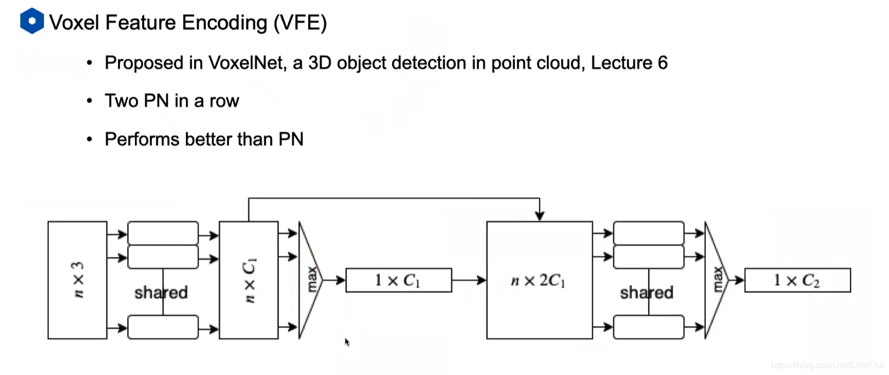

**VoxelNet**
---
<!-- TOC -->
- [架构组成](#架构组成)
- [特征学习网络](#特征学习网络)
  - [多层体素特征编码VFE](#多层体素特征编码vfe)
<!-- TOC -->

## 架构组成
- 特征学习网络
- 卷积中间层
- 区域提取网络

### 特征学习网络  

分则对点云数据进行处理，主要步骤有，
- 体素分块
- 点云分组
- 随机采样
- 多层体素特征编码VFE
- 稀疏4D张量表示

#### 多层体素特征编码VFE
> - 计算体素内所有点平均值作为质心；
> - 7维输入，$(x,y,z,r,x-c_x,y-c_y,z-c_z)$ ;
> - 输入到FC+BN+ReLU网络，得到NxC1维point-wise特征；
> - maxpooling, 得到local aggregated特征；
> - concatenate， 得到point-concatenated wise特征, Nx2C1；
> - 全卷积网络 NxC2维特征；
> - maxpooling, 1xC2;
